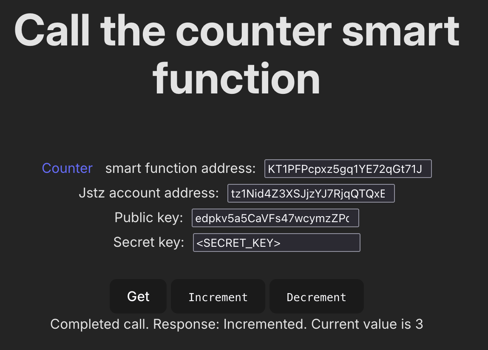

# Call a Jstz smart function from a web application

This is a [Vite](https://vite.dev/) application that shows how you can call a Jstz smart function from a web application.
It calls the [counter](https://github.com/jstz-dev/jstz/blob/main/examples/counter/README.md) smart function example.

**IMPORTANT: This application does not secure private keys and therefore should not be used in production.**

Follow these steps to use it:

1. Install Jstz and start the Jstz sandbox, as described in the Jstz [Quick start](https://jstz-dev.github.io/jstz/quick_start.html).

2. Ensure that you have a Jstz account and that it has been revealed in the sandbox.
   If you followed the instructions in the quick start, the account is revealed.
   If you created an account and have not used it in a transaction yet, reveal it by bridging one XTZ token to it by running `jstz bridge deposit --from bootstrap1 --to <MY_ACCOUNT> --amount 1 -n dev`, where `<MY_ACCOUNT>` is the address or alias of your account.

3. Deploy the counter smart function example with the instructions in its [`README.md` file](https://github.com/jstz-dev/jstz/blob/main/examples/counter/README.md) and copy the address of the deployed smart function.

4. Clone this repository and run `npm i` from the same directory as this file (`examples/call-from-web`).

5. Run `npm run dev` and open the application in a web browser at `http://localhost:5173/`.

6. Fill in the address of the deployed counter smart contract.

7. Fill in the information for your Jstz account, which you can find locally at `~/.jstz/config.json`.

8. Click the **Get**, **Increment**, and **Decrement** buttons and wait for the response from the smart function to appear below the buttons.

For more information about Jstz, see https://jstz-dev.github.io/jstz.
